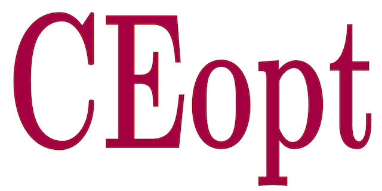

**CEopt: Cross-Entropy Optimizer** is a Matlab package that implements a framework for nonconvex optimization using the Cross-Entropy (CE) method. Due to the algorithm's relative simplicity, CEopt provides a transparent "gray-box" optimization solver with intuitive control parameters. It effectively handles both equality and inequality constraints through an augmented Lagrangian method, offering robustness and scalability for moderately sized complex problems. CEopt's applicability and effectiveness are demonstrated through select case studies, making it a practical addition to optimization research and application toolsets. More details are in the following paper:
- *A. Cunha Jr, M. V. Issa, J. C. Basilio and J. G. Telles Ribeiro, CEopt: A MATLAB Package for Nonconvex Optimization with the Cross-Entropy Method, under review, 2024*

Preprint available at:
xxx

## Reproducibility

Simulations done with **CEopt** are fully reproducible, as can be seen on this <a href="https://codeocean.com/capsule/xxx" target="_blank">CodeOcean capsule</a>.

## Authors
- Americo Cunha Jr
- Marcos Vinicius Issa
- Julio Cesar de Castro Basilio
- Jose Geraldo Telles Ribeiro

## Citing this study
We ask the code users to cite the following manuscript in any publications reporting work done with our code:
- *A. Cunha Jr, M. V. Issa, J. C. Basilio and J. G. Telles Ribeiro, CEopt: A MATLAB Package for Nonconvex Optimization with the Cross-Entropy Method, under review, 2024*

```
@article{Issa2024CROSS-OPT,
   author  = {A {Cunha~Jr} and M. V. Issa and J. C. Basilio and J. G. {Telles Ribeiro}},
   title   = "{CEopt: A MATLAB Package for Nonconvex Optimization with the Cross-Entropy Method}",
   journal = {Under Review},
   year    = {2024},
   volume  = {~},
   pages   = {~},
   doi    = {~},
}
```

## License
**CEopt** is released under the MIT license. See the LICENSE file for details. All new contributions must be made under the MIT license.

 

## Institutional support


## Funding

 &nbsp; &nbsp;   &nbsp; &nbsp; &nbsp; 
