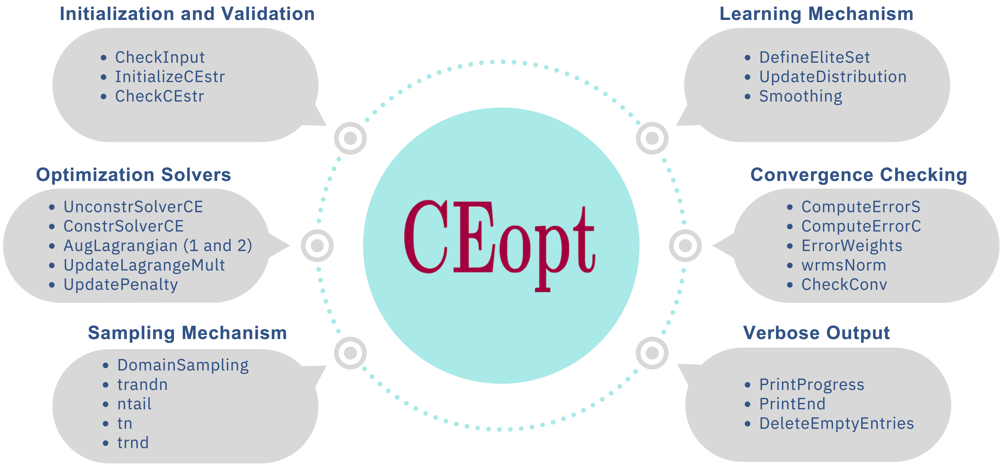
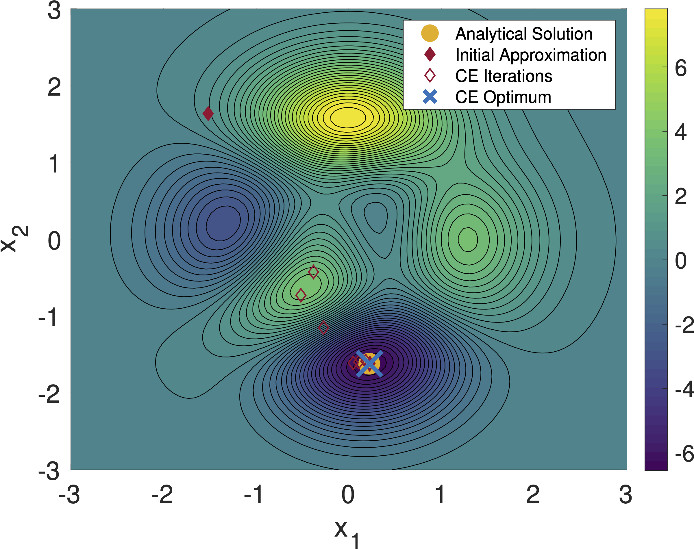
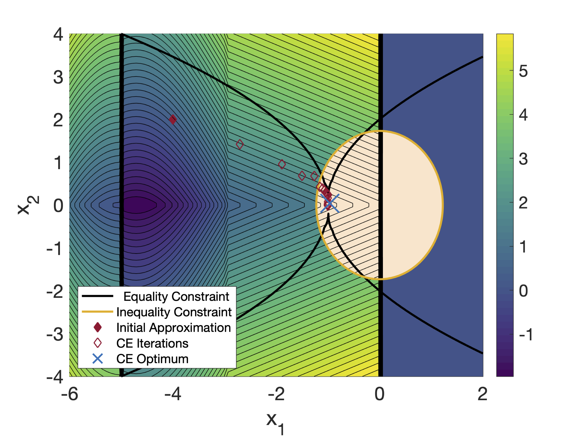

## Cross-Entropy Optimizer

**CEopt: Cross-Entropy Optimizer** is a Matlab package that implements a framework for nonconvex optimization using the Cross-Entropy (CE) method. Due to the algorithm's relative simplicity, CEopt provides a transparent "gray-box" optimization solver with intuitive control parameters. It effectively handles both equality and inequality constraints through an augmented Lagrangian method, offering robustness and scalability for moderately sized complex problems. **CEopt**'s applicability and effectiveness are demonstrated through select case studies, making it a practical addition to optimization research and application toolsets.

<p align="center">

</p>

### Table of Contents
- [Overview](#overview)
- [Features](#features)
- [Installation](#installation)
- [Usage](#usage)
- [Examples](#examples)
- [Reproducibility](#reproducibility)
- [Documentation](#documentation)
- [Authors](#authors)
- [Citing CEopt](#citing-ceopt)
- [License](#license)
- [Institutional Support](#institutional-support)
- [Funding](#funding)
- [Contact](#contact)

### Overview
**CEopt** was developed to provide a robust and scalable solution for nonconvex optimization problems using the Cross-Entropy method. More details can be found in the following paper:
- **A. Cunha Jr, M. V. Issa, J. C. Basilio, and J. G. Telles Ribeiro**, *CEopt: A MATLAB Package for Nonconvex Optimization with the Cross-Entropy Method, 2024 (under review)*

Preprint available at: [Preprint Link](xxx)

### Features
- Implements Cross-Entropy method for nonconvex optimization
- Handles equality and inequality constraints using augmented Lagrangian method
- Transparent "gray-box" optimization solver with intuitive control parameters
- Robust and scalable for moderately sized complex problems
- Demonstrated applicability through select case studies

### Installation
To install and get started with **CEopt**, follow these steps:
1. Clone the repository:
   ```bash
   git clone https://github.com/americocunhajr/CEopt.git
   ```
2. Navigate to the package directory:
   ```bash
   cd CEopt/CEopt-1.0
   ```
3. Copy the `CEopt.m` file to your working directory:
   ```bash
   cp CEopt.m 'path_to_working_directory'
   ```

Alternatively, you can add the `CEopt` directory to the Matlab path:
1. Open Matlab and type
   ```bash
   addpath 'path_to_CEopt_directory/CEopt/CEopt-1.0'
   ```
This will add `CEopt` to the path for the running section. Every time MATLAB is restarted this procedure must be repeated.

### Usage
To run CEopt, use the following commands in Matlab:
   ```bash
   [Xopt,Fopt,ExitFlag,CEstr] = CEopt(fun,xmean0,sigma0,lb,ub,nonlcon,CEstr)
   ```
Each parameter is described as follows:
- `fun`: Function handle for the objective function. This function must accept a 1 x Nvars row  vector  (representing a single sample) or an M x Nvars matrix (representing M samples with variables in columns) as input and return a scalar value or a row vector of M scalar values (for vectorized operations) respectively.
- `xmean0`: Initial mean of the design variables distributions.
- `sigma0`: Initial standard deviations for the design variables distributions.
- `lb`: Lower bounds for the design variables.
- `ub`: Upper bounds for the design variables.
- `nonlcon`: Function handle for the nonlinear constraints. Returns two arrays `G` (inequalities) and `H` (equalities).
- `CEstr`: Structure with settings for the CEopt algorithm.

The CEstr structure allows for extensive customization of the CE optimization process. Here's a breakdown of its fields:

- `Verbose`: Boolean flag to enable detailed output during optimization.
- `isConstrained`: Set to true if there are constraints defined by nonlcon.
- `isVectorized`: Set to true if fun and nonlcon can evaluate multiple rows of X in a single call.
- `Nvars`: Number of variables in the optimization problem.
- `EliteFactor`: Proportion of the population considered elite.
- `Nsamp`: Number of samples used in each iteration of the optimization.
- `MaxIter`: Maximum number of iterations for the optimization process.
- `MaxStall`: Maximum number of iterations without improvement before termination.
- `MaxFcount`: Maximum number of function evaluations allowed.
- `MinFval`: Target objective function value for early stopping.
- `TolAbs`: Absolute tolerance on the change in the objective function value for convergence.
- `TolRel`: Relative tolerance on the change in the objective function value for convergence.
- `TolCon`: Tolerance on the feasibility of constraints.
- `TolFun`: Tolerance on the change in function value for convergence.
- `alpha`: Smoothing parameter for the mean update.
- `beta`: Smoothing parameter for the standard deviation update.
- `q`: Smoothing parameter for standard deviation update.
- `NonlconAlgorithm`: Algorithm used for handling nonlinear constraints.
- `InitialPenalty`: Initial penalty coefficient for constraint violation.
- `PenaltyFactor`: Scaling factor for the penalty coefficient.

This extensive set of parameters and settings enables users to finely tune the CE optimization to their specific needs and problem characteristics.

### Examples

Below are step-by-step guides demonstrating how to use CEopt for different optimization tasks.

```matlab
% Unconstrained optimization with 2 variables

% objective function
F = @(x)PeaksFunc(x);

% bound for design variables
lb = [-3; -3];
ub = [ 3;  3];

% initialize mean and std. dev. vectors
mu0    = lb + (ub-lb).*rand(2,1);
sigma0 = 5*(ub-lb);
        
% define parameters for the CE optimizer
CEstr.isVectorized = 1;       % Vectorized function
CEstr.EliteFactor  = 0.1;     % Elite samples percentage
CEstr.Nsamp        = 50;      % Number of samples
CEstr.MaxIter      = 80;      % Maximum of iterations
CEstr.TolAbs       = 1.0e-2;  % Absolute tolerance
CEstr.TolRel       = 1.0e-2;  % Relative tolerance
CEstr.alpha        = 0.7;     % Smoothing parameter
CEstr.beta         = 0.8;     % Smoothing parameter
CEstr.q            = 10;      % Smoothing parameter

% CE optimizer
tic
[X_opt,F_opt,ExitFlag,CEstr] = CEopt(F,mu0,sigma0,lb,ub,[],CEstr)
toc

% objective function
function F = PeaksFunc(x)
    x1 = x(:,1);
    x2 = x(:,2);
     F = 3*(1-x1).^2.*exp(-x1.^2 - (x2+1).^2) ...
       - 10*(x1/5 - x1.^3 - x2.^5).*exp(-x1.^2 - x2.^2)...
       - (1/3)*exp(-(x1+1).^2 - x2.^2);
end
```

<p align="center">

</p>

```matlab
% Constrained optimization with 2 variables

% objective function and constraints
F       = @PatternSearchFunc;
nonlcon = @ConicConstraints;

% bound for design variables
lb  = [-6 -4];
ub  = [ 2  4];
mu0 = [-4  2];

% cross-entropy optimizer struct
CEstr.isVectorized  = 1;       % vectorized function
CEstr.TolCon        = 1.0e-6;  % relative tolerance

tic
[Xopt,Fopt,ExitFlag,CEstr] = CEopt(F,[],[],lb,ub,nonlcon,CEstr)
toc

% objective function
function F = PatternSearchFunc(x)
    x1 = x(:,1);
    x2 = x(:,2);
    F = zeros(size(x1,1),1);
    for i = 1:size(x,1)
        if  x1(i) < -5
            F(i) = (x1(i)+5).^2 + abs(x2(i));
        elseif x1(i) < -3
            F(i) = -2*sin(x1(i)) + abs(x2(i));
        elseif x1(i) < 0
            F(i) = 0.5*x1(i) + 2 + abs(x2(i));
        elseif x1 >= 0
            F(i) = .3*sqrt(x1(i)) + 5/2 + abs(x2(i));
        end
    end
end

% equality and inequality constraints
function [G,H] = ConicConstraints(x)
    x1 = x(:,1);
    x2 = x(:,2);
    G  = 2*x1.^2 + x2.^2 - 3;
    H  = (x1+1).^2 - (x2/2).^4;
end
```

<p align="center">

</p>

#### Note on Stochastic Nature of CEopt
The CE method, which underpins the CEopt package, is inherently stochastic. This means that each run of the optimization process might follow a different trajectory towards the optimum due to the random sampling involved in the method. Therefore, it is entirely normal for repeated executions of the same optimization task to yield different paths or convergence profiles. Users are encouraged to consider multiple runs or adjust the `sigma0` parameter to manage the exploration-exploitation balance and potentially achieve more consistent results.

### Reproducibility
The tutorials of **CEopt** package are fully reproducible. You can find a fully reproducible capsule of the simulations on <a href="https://codeocean.com/capsule/0007851/tree" target="_blank">CodeOcean</a>.

### Documentation
The routines in **CEopt** package are well-commented to explain their functionality. Each routine includes a description of its purpose, as well as inputs and outputs. Detailed documentation about the code functionality can be found in paper.

### Authors
- Americo Cunha Jr
- Marcos Vinicius Issa
- Julio Cesar de Castro Basilio
- Jose Geraldo Telles Ribeiro

### Citing CEopt
If you use **CEopt** in your research, please cite the following publication:
- *A. Cunha Jr, M. V. Issa, J. C. Basilio and J. G. Telles Ribeiro, CEopt: A MATLAB Package for Nonconvex Optimization with the Cross-Entropy Method, 2024 (under review)*

```
@article{CunhaJr2024CEopt,
   author  = {A {Cunha~Jr} and M. V. Issa and J. C. Basilio and J. G. {Telles Ribeiro}},
   title   = "{CEopt: A MATLAB Package for Nonconvex Optimization with the Cross-Entropy Method}",
   journal = {Under Review},
   year    = {2024},
   volume  = {~},
   pages   = {~},
   doi    = {~},
}
```

### License
**CEopt** is released under the MIT license. See the LICENSE file for details. All new contributions must be made under the MIT license.

 

### Institutional support


### Funding

 &nbsp; &nbsp;   &nbsp; &nbsp; &nbsp; 

### Contact
For any questions or further information, please contact:

Americo Cunha Jr: americo.cunha@uerj.br
